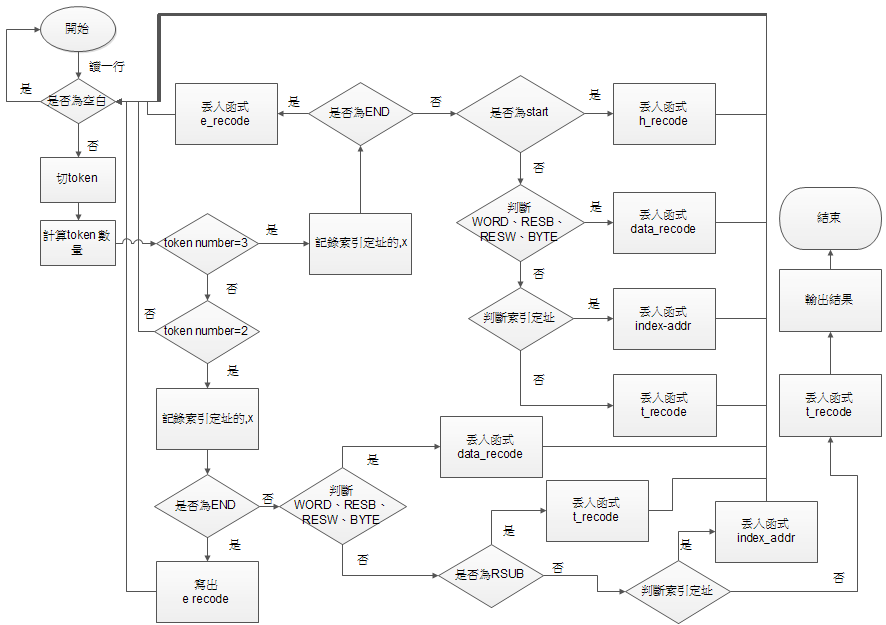

### simple-assembler

> 組譯器(assembler)，是將組合語言轉換成機器碼(machine code)的程式

> 此次成品是Beck所著的系統程式教科書中SIC機器的組譯器

以下為SIC組合語言的範例

***
這支程式是由JAVA所寫成

要將下列SIC組合語言，轉換成機器碼(machine code)

        . comment
          . indexed addressing
        .. free format coding
        . empty line detection
        . . comand line user filenames input
        
        COPY START 1000		. program start here
        FIRST STL RETADR
        CLOOP JSUB RDREC
        LDA  LENGTH
        COMP ZERO
        JEQ ENDFIL
        JSUB 	WRREC
        J CLOOP
        .
        .

完整版[Here](test.txt)
***
以下是程式的流程圖及Output，分為Pass 1及Pass 2

# Pass 1：將助記碼(mnemonic code)轉換成機器碼(machine code)。

> e.g.
>- STL -> 14
>- LDA -> 00

流程圖

Output

        7: 1000 COPY START 1000
        8: 1000 FIRST 14 RETADR
        9: 1003 CLOOP 48 RDREC
        10: 1006 00 LENGTH
        11: 1009 28 ZERO
        12: 100c 30 ENDFIL
        13: 100f 48 WRREC
        14: 1012 3C CLOOP

完整版[Here](out.txt)

# Pass 2：將符號式運算元(Symbolic operand)或符號式地址(Symbolic address)轉換成機器內部的表示法方式或記憶地址。

> e.g. 
>- 5 -> 0000 0000 0000 0000 0000 0101 0000 0000 0000 0000 0000 0101
>- RETADR －＞1033H

流程圖

Output

        H00COPY  1000 107a
        T 001000 1E 1410334820390010362810303010154820613C100300102a0C103900102d
        T 00101e 15 0C10364820610810334C0000454f46000003000000
        T 002039 1E 041030001030E0205d30203fD8205d2810303020575490392C205e38203f
        T 002057 1C 1010364C0000F1001000041030E02079302064509039DC20792C1036
        T 002073 07 3820644C000005
        E001000

經由Pass2處理過後的格式就是完整的機器碼(machine code)
