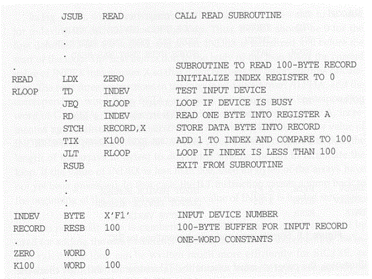
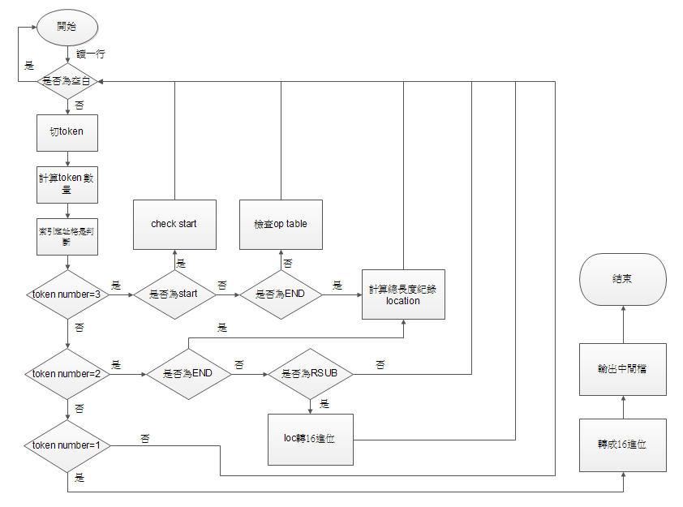

# simple-assembler

系統程式期末報告的成品

組譯器(assembler)，是將組合語言轉換成機器碼(machine code)的程式
  
此次成品是Beck所著的系統程式教科書中SIC機器的組譯器
  
以下為SIC組合語言的範例：

這支程式是由JAVA所寫成

以下是程式的流程圖，分為Pass 1及Pass 2

Pass 1：將助記碼(mnemonic code)轉換成機器碼(machine code)。

e.g. STL -> 14 ; LDA -> 00

